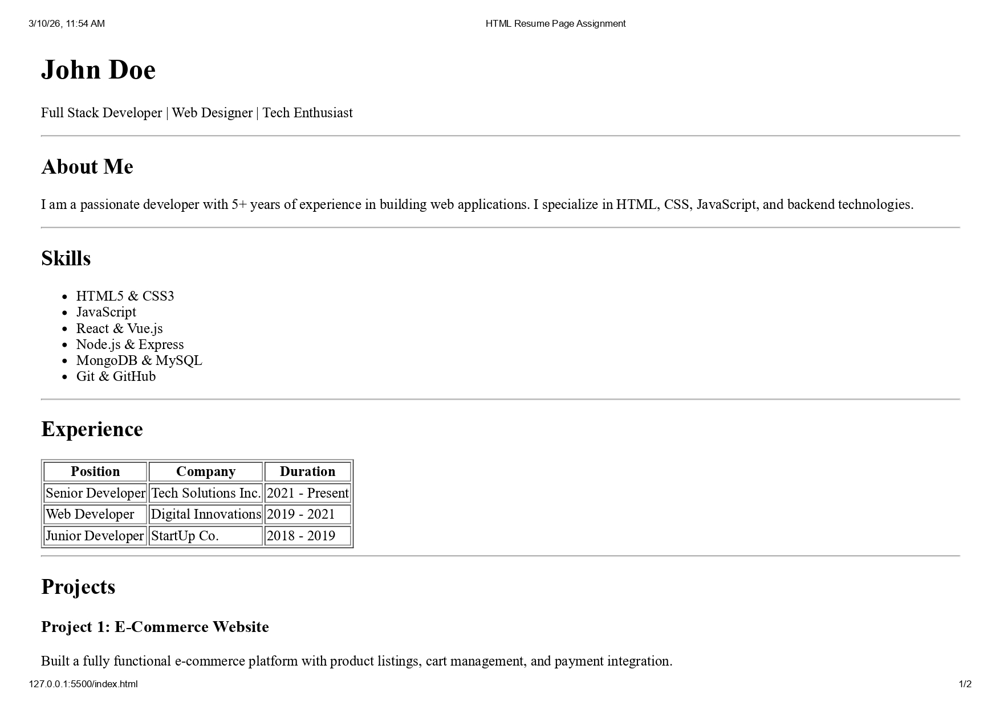
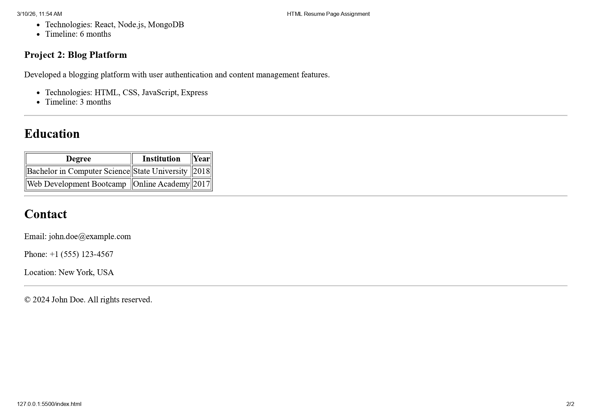

# HTML Resume Page Assignment

This project is a **single-page resume website built using only HTML**.  
The goal of this assignment is to practice proper HTML structure and semantic tags without using CSS.

## Features

The webpage contains the following sections:

- Header with name and role
- About Me section
- Skills list
- Experience table
- Projects section
- Education table
- Contact details

## Technologies Used

- HTML5

## How to Run

1. Clone the repository

```bash
git clone https://github.com/Krushna-wq/html-resume-page-assignment.git
```

2. Open the project folder.

3. Open the file `index.html` in your browser.

## Project Screenshot




Krushna Patil  
GitHub: https://github.com/Krushna-wq